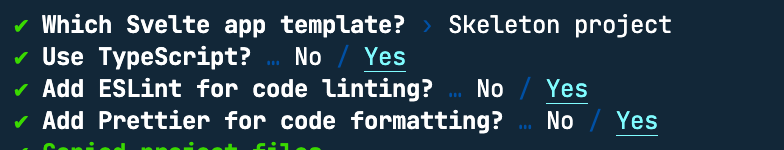
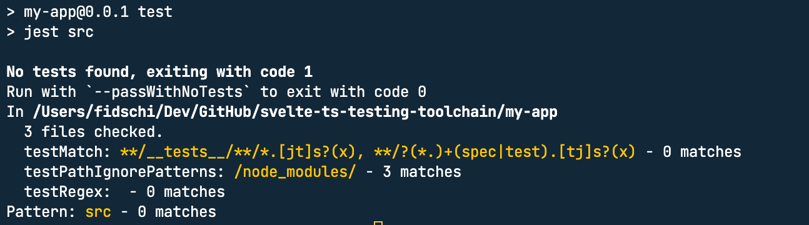

# Toolchain for testing Svelte components written in TypeScript

**Note** All of this information is combined from different sources. This should help you not going through all these sources again.
## The toolchain

Here is what we will use to test our Sveltekit website/app/... .
- [Jest](https://jestjs.io/)
- [ts-node](https://typestrong.org/ts-node/)
- [ts-jest](https://github.com/kulshekhar/ts-jest)
- [Svelte-Jester](https://github.com/mihar-22/svelte-jester#typescript)
- [Svelte Testing Library](https://testing-library.com/docs/svelte-testing-library/intro)

## Setup

First things first we generate a new SvelteKit project.

```bash
npm init svelte@next my-app
cd my-app
npm install
```
Answer the questions as shown in the screenshot.



Now we install all the devDependencies we need
```bash
npm install --save-dev jest ts-jest ts-node svelte-jester @testing-library/svelte @testing-library/jest-dom
``` 
Ok now we need to add some configuration to get everything up and running.

Create a [jest config file](./my-app/jest.config.cjs) file with the following content
```js
module.exports = {
  preset: 'ts-jest',
  // testEnvironment: 'jsdom',
  transformIgnorePatterns: ['<rootDir>/node_modules/'],
  transform: {
    "^.+\\.svelte$": [
      "svelte-jester",
      {
        "preprocess": true
      }
    ],
    "^.+\\.ts$": "ts-jest"
  },
  moduleFileExtensions: [
    "js",
    "ts",
    "svelte"
  ],
  setupFilesAfterEnv: ["@testing-library/jest-dom/extend-expect"]
};
``` 

To run the tests we add the following command to our package.json
```js
{
  "scripts": {
    "test": "jest src",
    "test:watch": "npm run test -- --watch"
  }
}
``` 

Now we run our first test
```bash
npm run test
```

The result should be similar to this



### Sources
- [Setup Svelte Testing Library](https://testing-library.com/docs/svelte-testing-library/setup)
- [Setup Svelte Jester](https://github.com/mihar-22/svelte-jester#typescript)
